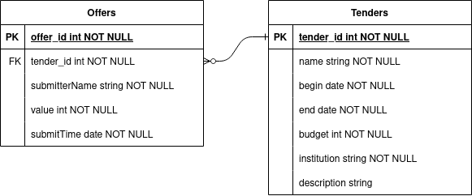
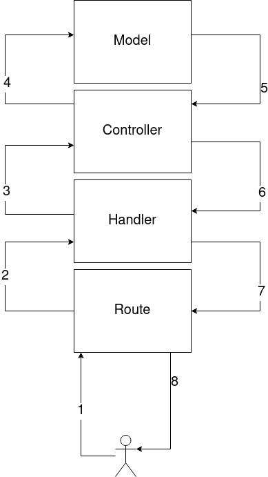

<span style="font-size:12px;font-family: 'Times New Roman'">
<h1>Identyfikacja zagadnienia biznesowego</h1>
Projekt częściowo zaspokaja potrzebę realizacji strony internetowej umożliwiającej dowolnej instytucji lub osobie ogłaszanie oraz branie udziału w przetargach finansowych. <br>
Dostarcza takie funkcjonalności biznesowe jak:
<li> Możliwość dodania nowego przetargu z określonym budżetem, opisem, nazwą, podmiotem organizującym oraz ramami czasowymi
<li> Możliwość przeglądania aktualnych przetargów
<li> Możliwość przeglądania zakończonych przetargów
<li> Możliwość składania ofert do aktualnych przetargów
<li> Możliwość wyświetlenia rozstrzygnięcia (lub informacji o braku) zakończonego przetargu

<br>
Aplikację można uznać za częściowe rozwiązanie, które należałoby rozszerzyć o opcje logowania konkretnych użytkowników/instytucji.<br>
Użytkownicy powinni posiadać odpowiednie role oraz uprawnienia, które dostarczyłyby między innymi takie funkcjonalności jak:
<li> Przypisanie nazwy użytkownikowi, przy pomocy której może zgłosić przetarg lub ofertę
<li> Rola admina pozwalająca wyświetlić i edytować wszystkie informacje
<br><br>

<h1>Wymagania systemowe i funkcjonalne</h1>
Wymagania funkcjonalne:
<li> Aplikacja powinna automatycznie dostrzec zakończenie aktualnego przetargu i od tego momentu wyświetlać go w zakładce zakończone
<li> Aplikacja powinna nie pozwolić użytkownikowi na złożenie oferty do zakończonego przetargu
<li> Aplikacja powinna nie pozwolić użytkownikowi przeglądania wyników ofert dla niezakończonego przetargu
<li> Aplikacja powinna informować użytkownika o sukcesie lub porażce wykonanej akcji takiej jak dodawanie przetargu/oferty wyświetlanie informacji w przypadku np. błędu po stronie serwera backendowego.
<li> Aplikacja powinna zabronić tworzenia przetargów z pustymi — wymaganymi z punktu widzenia biznesu polami np. budżetem.

Baza danych:
<li>Bazy danych powinny być przechowywane po stronie REST serwera
<li>Modele obiektów model przetargu oraz oferty w schemacie jeden do wielu:<br>


<h1>Analiza zagadnienia i jego modelowanie</h1>
<h2>Warstwy aplikacji backendowej</h2>

<li>1. Użytkownik wykonuje zapytanie restowe, które zostaję obsłużone przez serwer (np. GET /api/v1/tender/actual)
<li>2. Odpowiednio zdefiniowana ścieżka woła handler, który obsłuży zapytanie restowe z jego json body i ew. parametrami ścieżki
<li>3. Handler używając metod controllerów żąda informacji np. o aktualnych przetargach
<li>4. Controller wykorzystuje metody ORMowe dostępne dla konkretnych modeli zdefiniowane przez bibliotekę <b>Sequelize</b> (np. findaAll z dodatkowymi kondycjami o czasie zakończenia przetargu)
<li>5. Controller zwraca Promise żądanej metody ORMowej
<li>6. Handler czeka na dane (lub błąd/wyjątek) i odpowiednio je obsługuję zawierając logikę biznesową.
<li>7-8. Handler przygotowuję odpowiednie dane w formacie JSON razem ze status HTTP informującym o sukcesie lub błędzie operacji.

<h2>MVC</h2>
<ul>
<li> View
 <ul>
 <li> generowany html komponentu wypełniony obiektami pobranymi przez controller
 </ul>
<li> Controller
 <ul>
 <li> hooki useEffect wykonujące requesty, aby pobrać dane z backendu przy wyświetleniu odpowiedniej strony
 <li> metody wykonujące np POST do backendu dla button onClick w formularzu tworzenia przetargu
 </ul>
<li> Model
 <ul>
 <li> struktura obiektów zwracana przez REST API
 <li> informacja o endpointach backendu (ich inputy, outputy) 
 </ul>
</ul>

<h1>Implementacja</h1>
Wykorzystywana jest biblioteka <b>luxon</b> do operacji związanych z lokalnym czasem i jego formatem.
<h2>Backend:</h2>
<li> Biblioteka ORMowa Sequelize z bazą danych SQLite
<li> Wykorzystanie biblioteki express jako główna technologia dostarczająca server obsługę zapytań rozszerzona o bibliotekę 'body-parser' potrzebną do obsługi JSON body.
<h3>Dostępne endpointy:</h3>
 <b>/api/v1</b>
 <ul>
  <li>/offer</li>
  <ul>
    <li>GET /</li> - geter dla wszystkich ofert (nieużywany w praktyce)
    <li>GET /:id</li> - niezaimplementowany potencjalnie geter dla konkretnej oferty
    <li>POST /new</li> - tworzy nową ofertę dla konkretnego przetargu
  </ul>
  <li>/tender</li>
  <ul>
    <li>GET /</li> - zwraca wszystkie przetargi
    <li>GET /details/:id</li> - zwraca informacje o konkretnym przetargu
    <li>GET /actual</li> - zwraca listę przetargów, które są aktualne tzn. rozpoczęcie_przetargu < data_teraz < zakończenie_przetargu
    <li>GET /results/:id </li> - zwraca wyniki dla przetargu z ID: <b>id</b>
    <li>POST /new </li> - tworzy nowy przetarg
  </ul>  
</ul> 
<h2>Frontend:</h2>
Customowe hooki uzupełniające listę przetargów np. poprzez GET /api/v1/tender/actual oraz posiadające wiadomości informujące użytkownika o statusie wykonania RESTowego zapytania (np. ładowanie, błąd serwera). Wykorzystywane są przez komponenty do załadowania danych z serwera backendowego.

```javascript
    const [tenders, setTenders] = useState([]);
    const [message, setMessage] = useState(<p>Ładowanie przetargów...</p>);
    useEffect(() => {...
    // GET przy użyciu wrapera fetch...
    ...
    return {"tenders": [tenders, setTenders], "message": [message, setMessage]}
```

<h1>Podsumowanie</h1>
Aplikacja spełnia założone wymagania funkcjonalne w ramach rozszerzenia, można byłoby dodać obsługę logowania, panel admina (odpowiednie role). Stronę warto by było rozszerzyć o ładniejszy wygląd graficzny.
Problematyczna okazało się formatowanie czasu np. dla/z formularza — aby był ten sam UTC dla backendu i frontentu w sensie operacji, ale wyświetlany dla użytkownika w lokalnym czasie.
</span>

